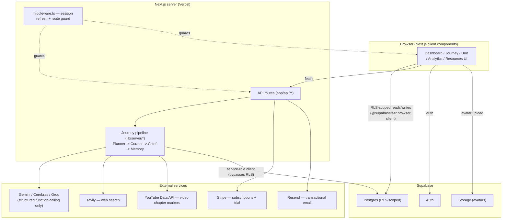

# METIS — your learning GPS

METIS is an AI-powered adaptive learning-roadmap product for high school and college
students. A student describes a goal ("Ace the AP Biology genetics unit," "Get through
system design for interviews"), and METIS researches a real reference syllabus,
generates a structured roadmap (units → chapters → learning objectives), curates and
vets actual web resources (articles, videos, practice sets) for each chapter, and then
adapts that roadmap over time through chat — re-pacing, re-sequencing, or refreshing
resources — instead of leaving the student to piece together forty browser tabs on
their own. It ships as a Next.js web app with a real Supabase-backed auth/database
layer, a multi-provider LLM pipeline (Gemini, Cerebras, Groq) split by task to spread
free-tier rate limits, Stripe subscription billing with a 7-day trial, and
Resend-backed transactional email.

The repository evolved from a static frontend prototype (see the early git history) into
a working product with a real backend; nothing described below is mocked unless a
section explicitly says so.

## Table of contents

- [Architecture](#architecture)
- [Tech stack](#tech-stack)
- [Getting started](#getting-started)
- [Environment variables](#environment-variables)
- [Scripts](#scripts)
- [The journey pipeline](#the-journey-pipeline)
- [Database schema (migrations)](#database-schema-migrations)
- [Project structure](#project-structure)
- [Known limitations / in-progress areas](#known-limitations--in-progress-areas)

## Architecture

Next.js App Router serves both the UI and the API. The browser talks to Supabase
directly for reads that are safe under Row Level Security (journeys, resources,
profile), and talks to Next.js API routes for anything that needs a secret key or
service-role privileges (LLM calls, Stripe, Resend, admin-scoped writes).



Key architectural decisions visible in the code:

- **RLS is the real security boundary, not the API layer.** Every table has Row Level
  Security policies chaining ownership back to `journeys.user_id = auth.uid()`
  (`supabase/migrations/0001_phase2_journey_schema.sql`). The browser's Supabase client
  uses the public anon key everywhere; it's safe by design because Postgres enforces
  who can see what.
- **Two Supabase clients, deliberately separated.** `lib/supabase/client.ts` /
  `server.ts` use the anon key and respect RLS. `lib/supabase/admin.ts` uses the
  service-role key, bypasses RLS, and throws immediately if imported into browser code
  — it exists only for the server-side journey pipeline and webhook handlers.
- **LLM calls are multi-provider by design**, not for redundancy's sake but to spread
  usage across separate free-tier rate-limit buckets: the Planner (low volume, best
  quality) uses Gemini 2.5 Flash with a Cerebras fallback if Gemini rate-limits; the
  Curator (high volume — one call per chapter) uses Cerebras; the Chief chat agent and
  Memory compression use two different Groq models so they don't share a quota
  (`lib/server/llm/config.ts`). Every call goes through **forced function-calling**
  (`lib/server/llm/`) — the pipeline never parses free-text LLM output.
- **Background work survives the HTTP response.** Curation and chat-triggered roadmap
  changes are kicked off with `runInBackground()` (`lib/server/background.ts`), which
  wraps Vercel's `waitUntil` so the work isn't killed when the response returns, with a
  plain-promise fallback for local dev where there's no Vercel request context.
- **Curation is resumable, not atomic.** A single curation run only has ~45s
  (`CURATOR_BUDGET_MS`) before Vercel's function timeout would kill it mid-write, so it
  processes chapters one at a time and stops cleanly if it runs out of budget. The
  client (`lib/data/use-journey-detail.ts`) polls while any chapter is `pending` and
  re-triggers `/api/journeys/[id]/curate` (throttled) until nothing is left — a big
  journey finishes across several resumptions instead of one long request.

## Tech stack

| Layer | Choice | Why (from the code) |
|---|---|---|
| Framework | Next.js 14 (App Router) + React 18 + TypeScript | Route handlers double as the backend API; no separate server process. |
| Styling | Tailwind CSS + `tailwindcss-animate` | Design tokens as CSS variables (`app/globals.css`, `tailwind.config.ts`) so light/dark and brand-color changes stay in one place. |
| UI primitives | Radix UI (`@radix-ui/react-*`) restyled in `components/ui/` | shadcn/ui-style pattern — accessible unstyled primitives, METIS's own visual layer on top. |
| Auth + database | Supabase (`@supabase/supabase-js`, `@supabase/ssr`) | Postgres + Row Level Security does the access control; `@supabase/ssr` keeps auth cookies in sync across server and client. |
| LLM providers | `@google/genai` (Gemini), `openai` SDK pointed at Cerebras/Groq's OpenAI-compatible endpoints | One SDK (`openai`) covers two providers since both expose OpenAI-compatible chat-completions APIs; only Gemini needs its native SDK. |
| Web search | Tavily (`lib/server/tavily.ts`, raw `fetch`) | Curator's source of real, current candidate resources — the pipeline never has the LLM invent URLs. |
| Video enrichment | YouTube Data API (`lib/server/youtube.ts`) | Optional: parses chapter-marker timestamps out of video descriptions; skipped gracefully if `YOUTUBE_API_KEY` is unset. |
| Billing | Stripe (`stripe` SDK) | Subscription checkout with a 7-day trial, billing portal, and webhook-driven entitlement sync. |
| Transactional email | Resend | Contact-form delivery only, currently. |
| Charts | Recharts | Analytics page (progress-over-time, weekly bars, 30-day trend). |
| Background execution | `@vercel/functions` (`waitUntil`) | Lets curation/chat-triggered work keep running after the HTTP response on Vercel's serverless runtime. |
| Fonts | Geist Sans/Mono + EB Garamond (`next/font/google`) | Self-hosted via `next/font`, no external font requests at runtime. |

## Getting started

### Prerequisites

- Node.js 18+ (Next.js 14 requirement)
- A [Supabase](https://supabase.com) project (free tier is fine)
- API keys for at least Gemini, Cerebras, Groq, and Tavily if you want journey
  creation/curation to work locally (see [Environment variables](#environment-variables))
- Optional: Stripe (test mode) and Resend accounts if you're working on billing or the
  contact form
- The [Stripe CLI](https://stripe.com/docs/stripe-cli) if you want to test webhooks
  locally (`stripe listen`)

### 1. Install dependencies

```bash
npm install
```

### 2. Configure environment variables

```bash
cp .env.example .env.local
```

Fill in `.env.local` — see [Environment variables](#environment-variables) for what
each key does and where to get it. `.env.local` is gitignored; never commit real keys.

### 3. Set up the Supabase database

The schema is **not** auto-applied — there is no migration runner wired up. Open your
Supabase project's **SQL Editor** and run each file in `supabase/migrations/` **in
numeric order** (0001 through 0009 as of this writing):

```
supabase/migrations/0001_phase2_journey_schema.sql   # journeys, units, chapters, resources, chat memory + RLS
supabase/migrations/0002_subscriptions.sql            # Stripe subscription state
supabase/migrations/0003_avatars_storage.sql           # public avatar Storage bucket + policies
supabase/migrations/0004_provider_usage.sql            # AI provider usage/rate-limit tracking
supabase/migrations/0005_journey_archive_and_resource_library.sql
supabase/migrations/0006_feature_usage.sql              # free-tier chat/re-route limit tracking
supabase/migrations/0007_contact_submissions.sql        # contact-form audit log + rate limit
supabase/migrations/0008_resource_completed_at.sql       # completion timestamps (powers Analytics)
supabase/migrations/0009_chapter_skill_level.sql          # knowledge-map "Know it"/"Familiar" marks
```

Each file is idempotent-ish (`create table if not exists`, `add column if not exists`)
but they are **not** transactional as a batch and do depend on earlier ones (e.g. 0004+
reference `auth.users`, ownership-chain helper functions from 0001). Run them in order.

Grab your project's URL/keys from **Supabase Dashboard → Settings → API** for the
`NEXT_PUBLIC_SUPABASE_URL` / `NEXT_PUBLIC_SUPABASE_ANON_KEY` / `SUPABASE_SERVICE_ROLE_KEY`
env vars.

### 4. (Optional) Stripe test mode

Create two recurring Prices in Stripe test mode (monthly + yearly) for the Premium
plan, put their IDs in `STRIPE_PRICE_PREMIUM_MONTHLY` / `_YEARLY`, and — to receive
webhooks locally — run:

```bash
stripe listen --forward-to localhost:3000/api/billing/webhook
```

Copy the `whsec_...` it prints into `STRIPE_WEBHOOK_SECRET`.

### 5. Run the dev server

```bash
npm run dev
```

Open `http://localhost:3000`. Sign up for a real account (Supabase Auth) — there is no
mock login anymore.

## Environment variables

All of these are documented with inline comments in `.env.example`. `NEXT_PUBLIC_*`
values are exposed to the browser by design; everything else is server-only and must
never be prefixed with `NEXT_PUBLIC_`.

| Variable | Required | Purpose |
|---|---|---|
| `NEXT_PUBLIC_SUPABASE_URL` | Yes | Supabase project URL. Example: `https://abcdefghijkl.supabase.co` |
| `NEXT_PUBLIC_SUPABASE_ANON_KEY` | Yes | Supabase anon/public key — RLS-scoped, safe for the browser. |
| `SUPABASE_SERVICE_ROLE_KEY` | Yes | Bypasses RLS. Server-only — used by `lib/supabase/admin.ts` for the journey pipeline and webhooks. |
| `GEMINI_API_KEY` | Yes | Powers the Planner (roadmap generation) and its judgment calls in the Curator. |
| `METIS_GEMINI_API_KEY` | No | Overrides `GEMINI_API_KEY` if a conflicting `GEMINI_API_KEY` exists in your shell environment. |
| `GROQ_API_KEY` | Yes | Powers the Chief chat agent and Memory compression (two different Groq models, separate quota buckets). |
| `CEREBRAS_API_KEY` | Yes | Powers the Curator (one call per chapter — highest-volume caller) and the Planner's rate-limit fallback. |
| `TAVILY_API_KEY` | Yes | Web search for both the Planner's reference-syllabus lookup and the Curator's candidate resources. |
| `YOUTUBE_API_KEY` | No | Video chapter-marker timestamps. Skipped gracefully if unset. |
| `LLM_PLANNER_PROVIDER` / `_MODEL`, `LLM_CURATOR_PROVIDER` / `_MODEL`, `LLM_CHIEF_PROVIDER` / `_MODEL`, `LLM_MEMORY_PROVIDER` / `_MODEL` | No | Per-agent provider/model overrides (`gemini`\|`groq`\|`cerebras`). See `lib/server/llm/config.ts`. |
| `LLM_PLANNER_FALLBACK_PROVIDER` / `_MODEL` | No | Fallback if Gemini rate-limits the Planner. Defaults to Cerebras `gpt-oss-120b`. |
| `LLM_FORCE_RATELIMIT` | No | Testing only — comma list of providers to force into throwing a rate-limit error. |
| `NEXT_PUBLIC_STRIPE_PUBLISHABLE_KEY` | For billing | Client-safe Stripe key. Example: `pk_test_...` |
| `STRIPE_SECRET_KEY` | For billing | Server-only. Example: `sk_test_...` |
| `STRIPE_WEBHOOK_SECRET` | For billing | From `stripe listen` (local) or the Stripe Dashboard webhook (deployed). |
| `STRIPE_PRICE_PREMIUM_MONTHLY` / `_YEARLY` | For billing | Stripe Price IDs for the Premium plan. Example: `price_1AbCdE...` |
| `RESEND_API_KEY` | For the contact form | From the Resend dashboard. |
| `CONTACT_TO_EMAIL` | For the contact form | Where contact-form submissions are delivered. |

Several server modules degrade gracefully instead of crashing when an optional key is
missing (YouTube timestamps skip silently; the AI-usage meter and feature-usage limits
hide themselves until their migration/table exists) — but the four LLM keys plus Tavily
are required for journey creation and curation to work at all.

## Scripts

From `package.json` — there are exactly four:

```bash
npm run dev      # next dev — starts the dev server (localhost:3000)
npm run build    # next build — production build; this is also the type-check step
npm run start    # next start — serve a production build
npm run lint     # next lint
```

**There is no `test` script and no test suite in this repository** (no `*.test.*` /
`*.spec.*` files, no CI config under `.github/`). `npm run build` is the closest thing
to a correctness gate today — it runs the TypeScript compiler in strict mode
(`tsconfig.json`) across the whole app.

## The journey pipeline

The product's core domain logic lives in `lib/server/` as four "agents," each mapped to
a stage comment in the source and each using **forced function-calling** — the LLM
never free-form's an answer the pipeline then tries to parse.

| Stage | File | What it does |
|---|---|---|
| 2 — Planner | `lib/server/planner.ts` | One Tavily search for a real reference syllabus, then one Gemini function call generates the full roadmap (units → chapters → learning objectives) sized to the goal's complexity and the student's hours/week. Also handles narrow single-chapter objective revisions (see below) and full re-plans of remaining material. |
| 3 — Curator | `lib/server/curator.ts` | Per chapter: Tavily search → ~8 candidates → Cerebras shortlists and judges fit/difficulty/scope → best 1–3 resources selected with justifications → YouTube timestamps attached if applicable. Trusted domains (Khan Academy, Coursera, MIT OCW, `.edu`) skip a lateral-reputation-check step. Falls back to a broadened search once; if still nothing usable, the chapter is flagged `no_resources_found` rather than silently left empty. Runs on a time budget (`CURATOR_BUDGET_MS`, default 45s) and is resumable. |
| 5 — Memory | `lib/server/memory.ts` | Compresses each chat exchange into a durable per-journey summary (`journey_chat_memory.compressed_notes`) — misconceptions, preferences, pacing signals — capped at ~1200 chars. Raw conversation is **not** stored. |
| 6 — Chief | `lib/server/chief.ts` | The "Ask METIS" chat agent. One function call classifies intent (`conversational` / `replan` / `resource_refresh`) and drafts the reply; roadmap-changing intents run in the background so the reply returns immediately. Chat-triggered adaptation only — nothing runs on a schedule. |

**Narrow-scope adjustment** (`app/api/journeys/[id]/chapters/[chapterId]/skill-level/route.ts`):
marking a knowledge-map node "Know it" or "Familiar" persists the mark
(`chapters.skill_level`), then calls the Planner for **just that one chapter** to
revise its learning objective, then the Curator re-fetches resources against the
revised objective for that chapter only — siblings, the unit, and the journey are
never touched. Resources are cleared and the chapter flips to `pending`, which arms the
same poll-while-pending mechanism curation already uses, so the UI updates live with no
dedicated polling code and no page reload.

## Database schema (migrations)

Postgres via Supabase, every table RLS-scoped back to `journeys.user_id = auth.uid()`
(or a dedicated `user_id` column for tables that don't hang off a journey). No ORM —
the app talks to Postgres through the Supabase client directly (PostgREST under the
hood), plus a few `security definer` SQL functions for cross-table RLS ownership
checks and atomic counters.

| Migration | Adds |
|---|---|
| `0001_phase2_journey_schema` | Core tables: `journeys`, `units`, `chapters`, `resources`, `journey_chat_memory`; ownership-chain RLS helper functions; the `journey_media_type_ratio` view. |
| `0002_subscriptions` | `subscriptions` — one row per user, Stripe plan/status, written server-side only. |
| `0003_avatars_storage` | Public `avatars` Storage bucket + per-user write policies. |
| `0004_provider_usage` | `provider_usage` + `record_provider_usage()` RPC — per-provider daily call/rate-limit counters for the AI capacity meter. |
| `0005_journey_archive_and_resource_library` | `journeys.completed_at`/`deleted_at` (soft delete + archive), `resources.saved_at`, `resource_folders` + `resource_folder_items`. |
| `0006_feature_usage` | `feature_usage` + `record_feature_usage()` RPC — free-tier chat-message/day and adaptive-re-route/month counters. |
| `0007_contact_submissions` | `contact_submissions` — contact-form audit log and IP rate-limit source. |
| `0008_resource_completed_at` | `resources.completed_at` — the one timestamp the Analytics page needed and didn't have. |
| `0009_chapter_skill_level` | `chapters.skill_level` — persists knowledge-map mastery marks. |

## Project structure

```
app/
  page.tsx, about/, pricing/, contact/          Public marketing pages
  login/, signup/, forgot-password/,
  reset-password/, auth/callback/               Real Supabase auth flow
  notifications/, settings/                     Standalone pages (StandaloneShell — back
                                                   button, no sidebar), still auth-gated by
                                                   middleware even though outside (app)/
  (app)/                                        Logged-in route group (sidebar shell, auth-gated)
    layout.tsx                                    Client-side auth guard (server-side guard is middleware.ts)
    dashboard/                                     Journey list + folders (drag-and-drop)
    journey/[id]/                                  Roadmap, resource list, Ask METIS panel
    journey/[id]/unit/[unitId]/                    Knowledge-map flowchart + chapter drill-down
    analytics/                                     Real usage/progress analytics (Pro-gated)
    archive/                                        Completed + soft-deleted journeys
    resources/                                      Saved-resource hub with folders
    upgrade/                                        In-app pricing/upgrade page
  api/
    journeys/                                     Create, curate, chat, skill-level adjustment
    billing/                                       Stripe checkout, portal, webhook
    contact/                                       Contact-form → Resend
    usage/                                          AI provider usage snapshot
    account/delete/                                Account deletion
    auth/callback/                                 Supabase auth callback

components/
  ui/            Base primitives (button, dialog, dropdown, tabs, ...) — Radix + Tailwind
  layout/        Sidebar, top bar, marketing nav/shell, page frames
  shared/        Logo, icon resolver, notifications/profile dropdowns, ProGate (Pro-tier paywall UI)
  dashboard/     Journey cards, folders, usage meter
  journey/       Journey creation, Ask METIS panel, roadmap, unit knowledge-map flowchart
  analytics/     Overview / per-journey / trends tabs (Recharts)
  pricing/       Shared plan cards + comparison table (used on both /pricing and /upgrade)
  auth/          Auth page shell

lib/
  server/          Server-only: the journey pipeline (planner/curator/chief/memory),
                    llm/ (multi-provider dispatch), stripe.ts, tavily.ts, youtube.ts,
                    background.ts (waitUntil wrapper), usage.ts / usage-limits.ts, auth.ts
  supabase/        client.ts (browser/anon), server.ts (SSR/anon), admin.ts (service-role, server-only)
  context/         app-context.tsx — the single client-side state provider (auth, journeys, folders)
  data/            Client-side data-access functions + hooks per domain
                    (journeys, analytics, resource-library, subscription, usage, profile)
  mock-data/       What's left of the original prototype — see Known limitations
  entitlements.ts  Pure free/pro plan-limit logic, shared by client and server

supabase/migrations/   Hand-run SQL migrations (see Database schema above)
middleware.ts           Server-side auth guard + session refresh for the (app) route group
public/                 Logo assets
```

## Known limitations / in-progress areas

Everything below is verified against the current code, not guessed:

- **No automated tests and no CI.** `package.json` has no `test` script; there are no
  `*.test.*`/`*.spec.*` files and no `.github/workflows/`. `npm run build`'s
  TypeScript check is the only automated correctness gate.
- **No migration runner.** The nine files in `supabase/migrations/` must be applied by
  hand, in order, via the Supabase SQL Editor. There's no `supabase db push`-style
  tooling wired into this repo, and no tracking of which migrations a given database
  has already run beyond reading the SQL yourself.
- **Notifications are entirely non-functional.** `lib/mock-data/notifications.ts`
  exports a permanently empty array; nothing anywhere in the codebase — no cron, no
  webhook, no trigger — ever populates it. The bell icon and `/notifications` page
  render real UI against data that never arrives.
- **Analytics deliberately omits "study time."** There is no session/duration log
  anywhere in the schema, and `journey_chat_memory` stores one compressed summary per
  journey, not a timestamped history — so total study time and per-message chat trends
  aren't computable from real data, and the Analytics page says so in-app rather than
  estimating them.
- **Archive's "purged in N days" is a countdown label, not an enforced deletion.**
  `lib/data/journeys.ts` computes `daysUntilPurge` for display, but nothing actually
  auto-purges old soft-deleted journeys yet — "Delete Permanently" is currently the
  only way trash is removed (see the comment above `PURGE_AFTER_DAYS`).
- **A leftover chat scaffold is unused.** `mockChats` in `lib/mock-data/chat.ts` is
  defined but no longer imported anywhere — real chat now goes through
  `/api/journeys/[id]/chat`. Only the tab labels (`chatTabs`) from that file are still
  used.
- **`lib/mock-data/user.ts`'s `MockUser` type is still the shape for the real user
  profile** in `app-context.tsx` (its `mockUser` sample object itself is unused) — the
  naming is a holdover from the original prototype, not a sign the profile data is
  fake; profile fields come from the real Supabase Auth user.
- **Single hardcoded free-tier limits.** `lib/entitlements.ts` hardcodes the free plan
  at 1 active journey, 10 chat messages/day, and 3 adaptive re-routes/month — there's
  no admin UI or per-user override for these.
- **No license file, and `package.json` sets `"private": true`** — this repo is not
  currently set up for external reuse or distribution.

---

For the standing engineering workflow (commit/deploy conventions, environment notes for
whoever is actively developing this), see `CLAUDE.md`.
